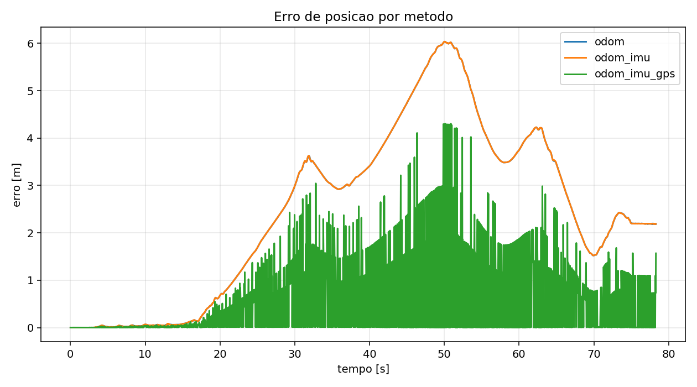
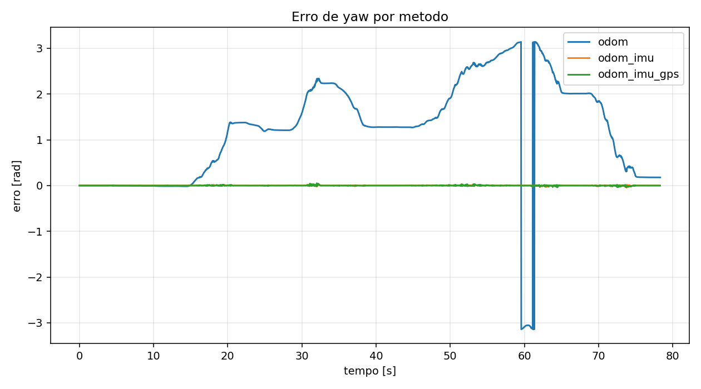
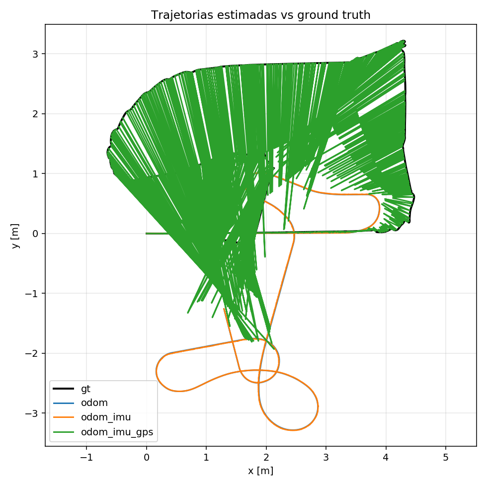

# Localiza-o-Robotica

Pacote ROS para comparar tres configuracoes de localizacao do Clearpath Husky no Gazebo usando o `ekf_localization_node` do pacote `robot_localization`:

- odometria;
- odometria + IMU;
- odometria + IMU + GPS convertido para odometria local.

O topico `/gt/odom` e publicado apenas para avaliacao e nunca e usado como entrada do filtro.

## Configuracao do ambiente

O projeto possui um `dockerfile` para preparar o ambiente ROS/Gazebo usado nos testes. Baixe esse arquivo individualmente, coloque-o em uma pasta de trabalho e gere a imagem Docker a partir dele:

```bash
docker build -t localiza_o_robotica_ros -f dockerfile .
```

Depois que a imagem for criada, inicie o container:

```bash
docker run -it \
  --env DISPLAY=$DISPLAY \
  --env QT_X11_NO_MITSHM=1 \
  --volume /tmp/.X11-unix:/tmp/.X11-unix:rw \
  --network host \
  --name ros_lar_run \
  <sua_imagem>
```

Substitua `<sua_imagem>` pelo nome da imagem gerada no passo anterior, por exemplo `localiza_o_robotica_ros`.

No host, antes de abrir interfaces graficas pelo Docker, libere o acesso ao X11:

```bash
xhost +local:docker
```

Dentro do container, clone este repositorio dentro de `~/catkin_ws/src/`:

```bash
mkdir -p ~/catkin_ws/src
cd ~/catkin_ws/src
git clone <link-do-repositorio>
```

Somente depois disso compile o workspace:

```bash
cd ~/catkin_ws
catkin build localiza_o_robotica
source devel/setup.bash
```

Sempre que abrir um novo terminal no container, carregue o ambiente:

```bash
docker exec -it ros_lar_run bash
export LIBGL_ALWAYS_SOFTWARE=1
source /opt/ros/noetic/setup.bash
source ~/catkin_ws/devel/setup.bash
```

## Topicos

Entradas esperadas:

- `/wheel/odom` (`nav_msgs/Odometry`)
- `/imu/data` (`sensor_msgs/Imu`)
- `/fix` (`sensor_msgs/NavSatFix`)
- `/gt/odom` (`nav_msgs/Odometry`, gerado a partir do Gazebo)

Saidas principais:

- `/gps/odom` (`nav_msgs/Odometry`)
- `/odometry/filtered` (`nav_msgs/Odometry`)
- `results/<modo>_metrics.csv`
- `results/<modo>_summary.txt`
- `results/<modo>_plot.png`

## Bag de teste

O repositorio ja inclui uma bag padrao em:

```bash
bags/husky_trajectory.bag
```

Voce pode usar essa bag diretamente para reproduzir os testes ou gravar sua propria trajetoria. Atencao: ao gravar uma nova bag no mesmo caminho, a bag padrao que vem no repositorio sera apagada/substituida.

## Gravando uma nova trajetoria

Abra quatro terminais dentro do container e carregue o ambiente em todos eles:

```bash
export LIBGL_ALWAYS_SOFTWARE=1
source /opt/ros/noetic/setup.bash
source ~/catkin_ws/devel/setup.bash
```

Terminal 1:

```bash
roscore
```

Terminal 2:

```bash
roslaunch lar_gazebo lar_husky.launch
```

Terminal 3:

```bash
rosrun rqt_robot_steering rqt_robot_steering
```

Na interface do `rqt_robot_steering`, selecione o topico de comando do Husky, normalmente `/husky_velocity_controller/cmd_vel` ou `/cmd_vel`.

Terminal 4:

```bash
roslaunch localiza_o_robotica record_trajectory.launch \
  bag:=$(rospack find localiza_o_robotica)/bags/husky_trajectory.bag
```

Manipule o robo com o joystick gerado no Terminal 3. Depois de um tempo, pare a gravacao no Terminal 4 com `Ctrl+C`. Por padrao, o launch usa o topico `/gazebo_ground_truth/odom`, gerado pelo plugin P3D configurado em `lar_gazebo/husky_urdf_extras/gazebo_ground_truth.urdf`, e o relaya para `/gt/odom`. Esse topico ja aplica o offset do mundo do Husky. O bag vai conter os topicos `/wheel/odom`, `/imu/data`, `/navsat/fix` e `/gt/odom`. Se uma nova bag for gravada dessa forma, o replay deve ser executado com `gt_offset_x:=0.0 gt_offset_y:=0.0`, pois o ground truth ja estara corrigido na gravacao.

## Executando os testes com a bag

Para reproduzir a bag ja gravada e comparar os tres modos de localizacao, nao e necessario abrir Gazebo, subir o mundo, usar `rqt_robot_steering` ou iniciar `roscore` manualmente. O `roslaunch` usado pelo script inicia o master ROS quando precisar, executa a bag e encerra tudo no final.

Use um unico terminal com o ambiente carregado:

```bash
cd ~/catkin_ws
source devel/setup.bash
rosrun localiza_o_robotica run_replay.sh
```

O script limpa os resultados antigos desses modos, executa automaticamente:

- `odom`
- `odom_imu`
- `odom_imu_gps`

Cada replay termina sozinho quando a bag acaba e grava os arquivos em `results/`:

```bash
results/<modo>_metrics.csv
results/<modo>_summary.txt
results/<modo>_plot.png
results/comparison_position_error.png
results/comparison_yaw_error.png
results/comparison_trajectories.png
```

## Metricas geradas

O script `localization_metrics.py` compara `/odometry/filtered` com `/gt/odom` e calcula:

- erro instantaneo de posicao;
- RMSE de posicao;
- erro final de posicao;
- RMSE de orientacao em yaw;
- erro final de orientacao em yaw.

## Resultados e discussao

Os resultados obtidos ficam em `results/` e permitem comparar o desempenho dos tres modos. A bag original foi gravada com o Husky deslocado no mundo (`x=4.65`, `y=3.0`), enquanto a odometria do robo comeca perto de zero. Por isso, o replay passa explicitamente o offset fixo `gt_offset_x=-4.65` e `gt_offset_y=-3.0` para as metricas, colocando o ground truth no mesmo referencial da odometria antes de calcular os erros.

Na execucao abaixo, o modo `odom_imu_gps` teve o menor erro de posicao, com RMSE de 0,532 m e erro final de 0,004 m. Os modos `odom` e `odom_imu` ficaram muito proximos em posicao, por volta de 1,404 m de RMSE. Na orientacao, a IMU reduziu bastante o erro de yaw em comparacao com odometria pura.

| modo | amostras | RMSE posicao (m) | erro final posicao (m) | RMSE yaw (rad) | erro final yaw (rad) |
| --- | ---: | ---: | ---: | ---: | ---: |
| `odom` | 2105 | 1.404986 | 0.745163 | 0.021598 | 0.000186 |
| `odom_imu` | 2100 | 1.403560 | 0.745153 | 0.005231 | 0.000186 |
| `odom_imu_gps` | 2101 | 0.532024 | 0.004468 | 0.005585 | 0.000186 |

Esses resultados indicam que a IMU melhora principalmente a estimativa angular, enquanto o GPS melhora a posicao global quando o ground truth e a odometria sao comparados no mesmo referencial.

O grafico de erro de posicao mostra a reducao do erro no modo com GPS em relacao aos modos sem GPS:



O grafico de erro de yaw evidencia melhor a vantagem dos modos com IMU:



Por fim, o grafico de trajetorias compara a estimativa filtrada de cada modo com o ground truth usado apenas para avaliacao:


